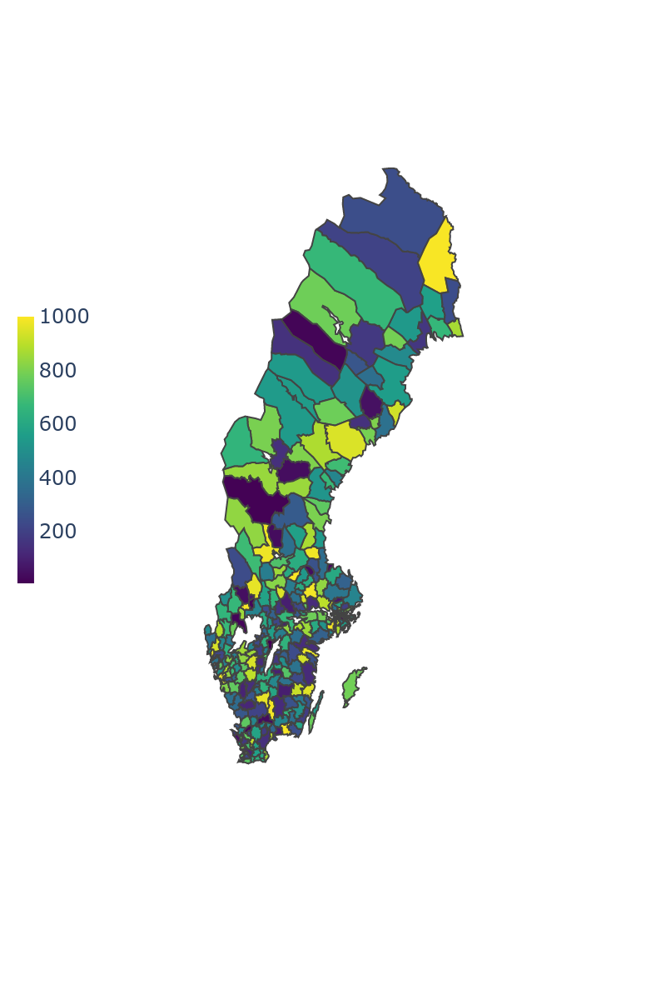
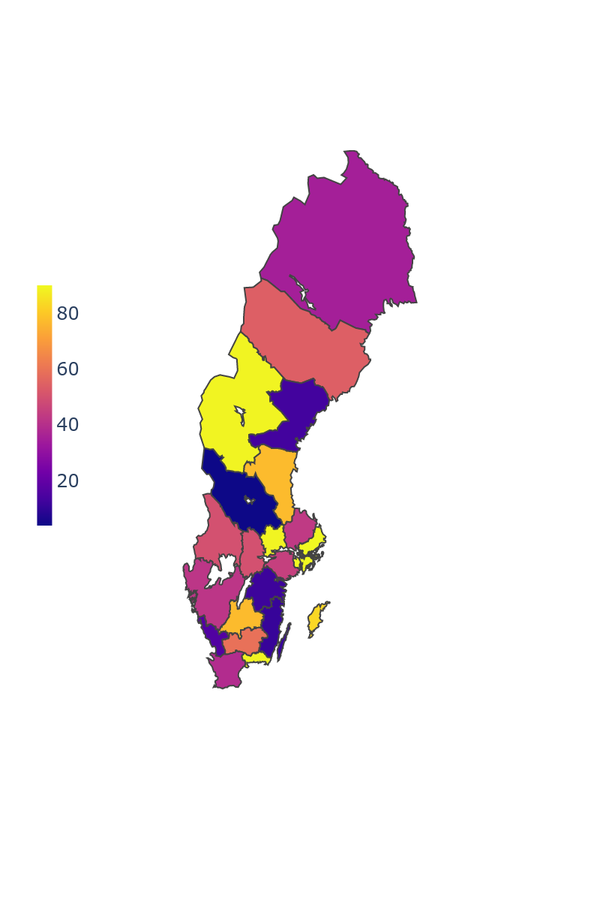

# swe-maps

Swedens municipalities and regions in GeoJSON format for easy usage with Plotly.  
  
The GeoJSON files are created with `geopandas`, using the shape files published by [Statistics Sweden](https://www.scb.se/hitta-statistik/regional-statistik-och-kartor/regionala-indelningar/digitala-granser/).

Municipalities             |  Regions
:-------------------------:|:-------------------------:
 | 

## Plotly example

```python

>>> with open("swe-maps-kommun.geojson", "r") as file:
        geo_kommun = json.load(file)

>>> df.head()
shape: (5, 2)
┌──────────┬───────┐
│ Kommun   ┆ Value │
│ ---      ┆ ---   │
│ str      ┆ i64   │
╞══════════╪═══════╡
│ Ale      ┆ 544   │
│ Alingsås ┆ 749   │
│ Alvesta  ┆ 771   │
│ Aneby    ┆ 241   │
│ Arboga   ┆ 763   │
└──────────┴───────┘

>>> fig = px.choropleth(
        df,
        geojson=geo_kommun,
        color="Value",
        locations="Kommun",
        featureidkey="properties.KnNamn",
        projection="mercator",
        color_continuous_scale="Viridis",
        fitbounds="locations",
        basemap_visible=False,
    )

```
