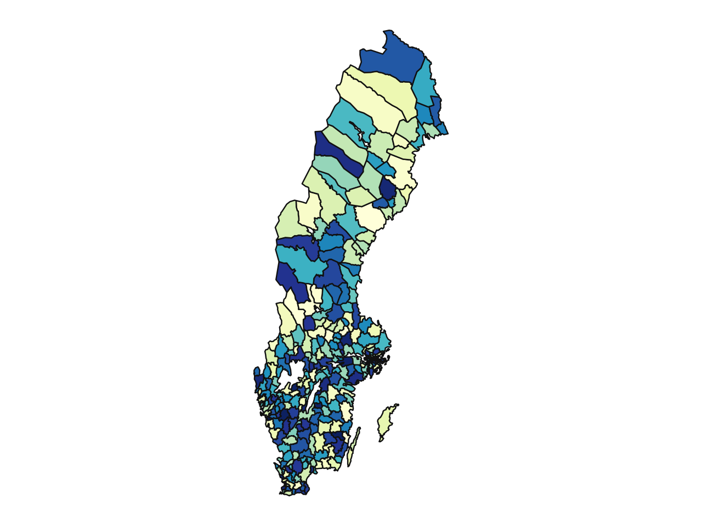
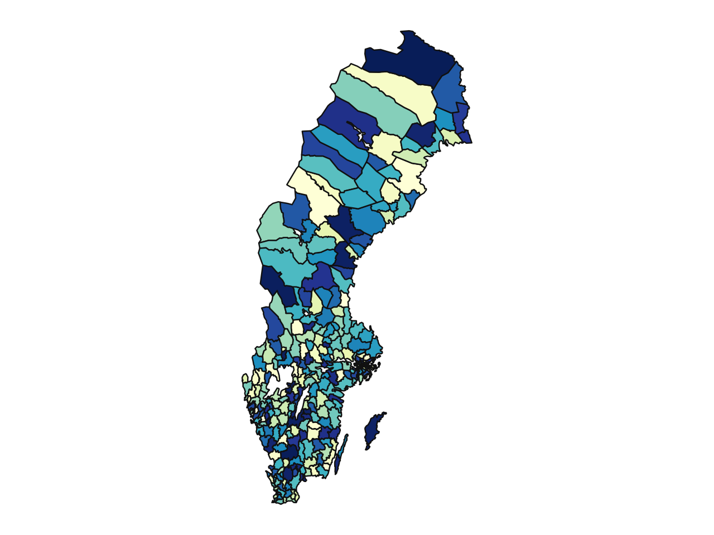

# swemaps

Maps of Sweden in [GeoParquet](https://github.com/opengeospatial/geoparquet) for easy usage.  

The parquets have been created from files published by:
- [Statistics Sweden](https://www.scb.se/hitta-statistik/regional-statistik-och-kartor/regionala-indelningar/) 
- [The Swedish Agency for Economic and Regional Growth](https://tillvaxtverket.se/tillvaxtverket/statistikochanalys/statistikomregionalutveckling/regionalaindelningar/faregioner.1799.html)
- [Swedish Election Authority](https://www.val.se/valresultat/riksdag-region-och-kommun/2022/radata-och-statistik.html)

 The map data includes counties, municipalities, electoral districts and FA regions. The original geometries have been transformed from SWEREF 99 TM (EPSG:3006) to WGS 84 (EPSG:4326) for better out-of-the-box compatibility with interactive and web-based toolkits such as Folium and Plotly. The column names have also been somewhat sanitized (e.g. `KnKod` -> `kommun_kod`).

The package gets you the file path so that you can load it with your prefered tool, for example PyArrow or GeoPandas. An extra convenience function is included to quickly convert a PyArrow Table object to GeoJSON.

Made for Python with inspiration from [swemaps2](https://github.com/filipwastberg/swemaps2).   

## Municipalities and counties

Municipalities             |  Counties
:-------------------------:|:-------------------------:
 | 

### PyArrow example with Plotly

```python
>>> import plotly.express as px
>>> import pyarrow.parquet as pq
>>> import swemaps

# Load the map for the specified type
>>> kommuner = pq.read_table(swemaps.get_path("kommun"))

>>> kommuner.column_names
['kommun_kod', 'kommun', 'geometry']

# The convenience function returns GeoJSON from a PyArrow table object
>>> geojson = swemaps.table_to_geojson(kommuner)

# Here's a dataframe with municipalities and some random values that we can plot
>>> df.head()
shape: (5, 2)
┌──────────┬───────┐
│ Kommun   ┆ Value │
│ ---      ┆ ---   │
│ str      ┆ i64   │
╞══════════╪═══════╡
│ Ale      ┆ 544   │
│ Alingsås ┆ 749   │
│ Alvesta  ┆ 771   │
│ Aneby    ┆ 241   │
│ Arboga   ┆ 763   │
└──────────┴───────┘

# Use Plotly to create a choropleth using the dataframe and GeoJSON
>>> fig = px.choropleth(
        df,
        geojson=geojson,
        color="Value",
        locations="Kommun",
        featureidkey="properties.kommun",
        projection="mercator",
        color_continuous_scale="Viridis",
        fitbounds="locations",
        basemap_visible=False,
    )
```

You might want to subset the map of municipalities for a specific county or a group of counties. Since the geometry is loaded as a PyArrow table the filter operation is straightforward.

```python
>>> import pyarrow.compute as pc

>>> kommuner.schema 

kommun_kod: string
kommun: string
geometry: binary
  -- field metadata --
  ARROW:extension:metadata: '{"crs":{"$schema":"https://proj.org/schemas/' + 1296
  ARROW:extension:name: 'geoarrow.wkb'
-- schema metadata --
geo: '{"version":"1.1.0","primary_column":"geometry","columns":{"geometry' + 1621

# County code for Skåne is 12
>>> kommuner = kommuner.filter(pc.starts_with(pc.field("kommun_kod"), "12"))

>>> geojson = swemaps.table_to_geojson(kommuner)
```

You could also use list comprehension on the GeoJSON to filter it.

```python
>>> geojson["features"] = [
        feature
        for feature in geojson["features"]
        if feature["properties"]["kommun_kod"].startswith("12")
        ]
```

Anyway, now we can plot Skåne.
```python
>>> skane = px.choropleth(
        df,
        geojson=geojson,
        color="Value",
        locations="Kommun",
        featureidkey="properties.kommun",
        projection="mercator",
        color_continuous_scale="Viridis",
        fitbounds="locations",
        basemap_visible=False,
        title="Skåne municipalities"
    )

skane.show()
```


### GeoPandas and plotnine

Another possibility is to load the GeoParquet into a GeoDataFrame.

```python
>>> import geopandas as gpd

>>> gdf = gpd.read_parquet(swemaps.get_path("lan"))

>>> gdf.head()

  lan_kod                lan                                           geometry
0      01     Stockholms län  MULTIPOLYGON (((17.24034 59.24219, 17.28475 59...
1      03        Uppsala län  MULTIPOLYGON (((17.36606 59.61224, 17.35475 59...
2      04  Södermanlands län  MULTIPOLYGON (((15.95815 58.96497, 15.8613 58....
3      05  Östergötlands län  MULTIPOLYGON (((14.93369 58.13112, 14.89472 58...
4      06     Jönköpings län  MULTIPOLYGON (((14.98311 57.9345, 15.00458 57....

# And with matplotlib installed as well we can have quick look
>>> gdf.plot()
```


For best results with `plotnine` you can either reproject to SWEREF 99 TM or set the aspect ratio in `coord_fixed()`. A ratio of around 1.96 to 1.98 should be near optimal.

```python
>>> gdf = gpd.read_parquet(swemaps.get_path("kommun"))

# Insert some random values
>>> gdf["value"] = np.random.randint(1, 600, size=len(gdf["kommun"]))

# Reproject back to SWEREF 99 TM
>>> gdf = gdf.to_crs(epsg=3006)

>>> (
    ggplot(gdf, aes(fill="value"))
    + geom_map(show_legend=False)
    + coord_fixed() # Or skip the reprojection above and set ratio manually here
    + scale_fill_cmap("YlGnBu")
    + theme(
        axis_ticks=element_blank(),
        panel_background=element_rect(fill="white"),
        axis_text_x=element_blank(),
        axis_text_y=element_blank(),
    )
  )
```

SWEREF 99 TM             |  WGS 84
:-------------------------:|:-------------------------:
 | 


## Additional map data
Larger datasets including geometries for electoral districts, RegSO, and DeSO can be manually fetched. Once downloaded the files are cached for efficient reuse.

```python
>>> districts = swemaps.fetch_map("valdistrikt_2022")
>>> districts
PosixPath('/home/stefur/.cache/swemaps-data/v0.2.0/valdistrikt_2022.parquet')
```
