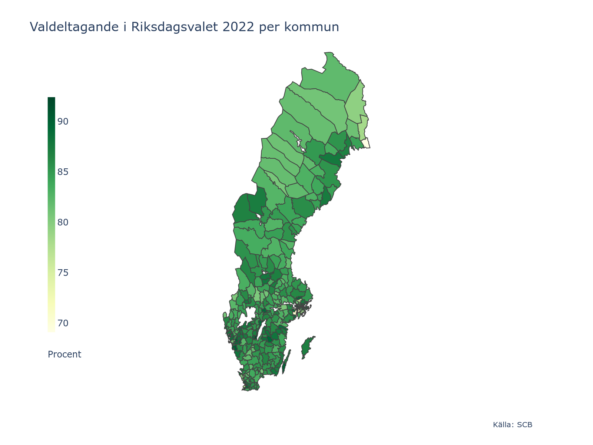

# swe-maps

Swedens municipalities and regions in GeoJSON format.
The GeoJSON files are created with `geopandas`, using the shape files published by [Statistics Sweden](https://www.scb.se/hitta-statistik/regional-statistik-och-kartor/regionala-indelningar/digitala-granser/) (see `geojson.py`` for details).

