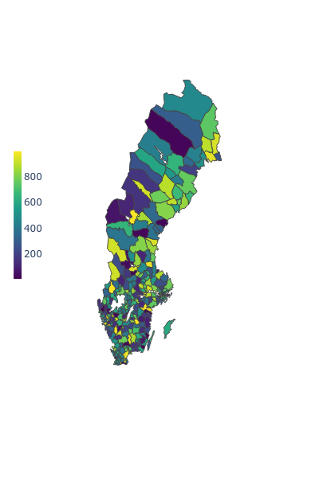
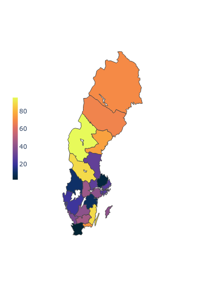
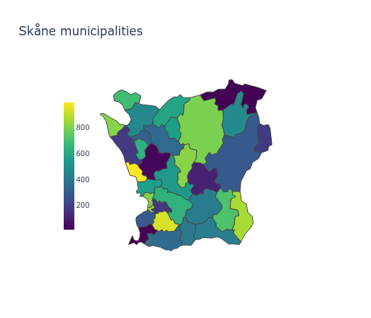
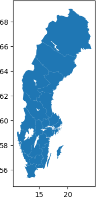

# swemaps

Maps of Sweden in [GeoParquet](https://github.com/opengeospatial/geoparquet) for easy usage.  

The parquets have been created from files published by [Statistics Sweden](https://www.scb.se/hitta-statistik/regional-statistik-och-kartor/regionala-indelningar/) and [The Swedish Agency for Economic and Regional Growth](https://tillvaxtverket.se/tillvaxtverket/statistikochanalys/statistikomregionalutveckling/regionalaindelningar/faregioner.1799.html). Maps include counties, municipalities and FA regions. The original geometries have been transformed from SWEREF 99 TM to WGS 84 for better compatibility across different tools. The column names have also been somewhat sanitized (e.g. `KnKod` -> `kommun_kod`).

The package gets you the file path so that you can load it with your prefered tool, for example PyArrow or GeoPandas. An extra helper function is included to quickly convert a PyArrow table to GeoJSON.

Made for Python with inspiration from [swemaps2](https://github.com/filipwastberg/swemaps2).   

## Municipalities and counties

Municipalities             |  Counties
:-------------------------:|:-------------------------:
 | 

### PyArrow example with Plotly

```python
>>> import pyarrow.parquet as pq
>>> import swemaps

# This loads the map for the specified type
>>> kommuner = pq.read_table(swemaps.get_path("kommun"))

>>> kommuner.column_names
['kommun_kod', 'kommun', 'geometry']

# This helper function returns GeoJSON from a PyArrow table
>>> geojson = swemaps.pyarrow_to_geojson(kommuner)

# Here's a dataframe with municipalities and some random values that we can plot
>>> df.head()
shape: (5, 2)
┌──────────┬───────┐
│ Kommun   ┆ Value │
│ ---      ┆ ---   │
│ str      ┆ i64   │
╞══════════╪═══════╡
│ Ale      ┆ 544   │
│ Alingsås ┆ 749   │
│ Alvesta  ┆ 771   │
│ Aneby    ┆ 241   │
│ Arboga   ┆ 763   │
└──────────┴───────┘

>>> fig = px.choropleth(
        df,
        geojson=geojson,
        color="Value",
        locations="Kommun",
        featureidkey="properties.kommun",
        projection="mercator",
        color_continuous_scale="Viridis",
        fitbounds="locations",
        basemap_visible=False,
    )

```

You could also subset the map of municipalities for a specific county or a group of counties. Since the geometry is loaded as a PyArrow table the filter operation is straightforward.

```python
>>> import pyarrow.compute as pc

>>> kommuner.schema 

kommun_kod: string
kommun: string
geometry: binary
-- schema metadata --
geo: '{"version":"1.0.0","primary_column":"geometry","columns":{"geometry' + 1478

# County code for Skåne is 12
>>> kommuner = kommuner.filter(pc.starts_with(pc.field("kommun_kod"), "12"))

>>> geojson = swemaps.pyarrow_to_geojson(kommuner)
```

You could also use list comprehension on the GeoJSON to filter it.

```python
>>> geojson["features"] = [
        feature
        for feature in geojson["features"]
        if feature["properties"]["kommun_kod"].startswith("12")
        ]
```

Anyway, now we can plot Skåne.
```python
>>> skane = px.choropleth(
        df,
        geojson=geojson,
        color="Value",
        locations="Kommun",
        featureidkey="properties.kommun",
        projection="mercator",
        color_continuous_scale="Viridis",
        fitbounds="locations",
        basemap_visible=False,
        title="Skåne municipalities"
    )

fig.show()
```



## GeoPandas example

You can load the GeoParquet into a GeoDataFrame as well.

```python
>>> import geopandas as gpd

>>> gdf = gpd.GeoDataFrame.read_parquet(swemaps.get_path("lan"))

>>> gdf.head()

lan_kod            lan                                           geometry
0      01     Stockholms  MULTIPOLYGON (((17.24034 59.24219, 17.28475 59...
1      03        Uppsala  POLYGON ((17.36606 59.61224, 17.35475 59.60292...
2      04  Södermanlands  POLYGON ((15.95815 58.96497, 15.86130 58.99856...
3      05  Östergötlands  POLYGON ((14.93369 58.13112, 14.89472 58.08986...
4      06     Jönköpings  POLYGON ((14.98311 57.93450, 15.00458 57.89598...

# And with matplotlib installed as well we can have quick look
>>> gdf.plot()
```


